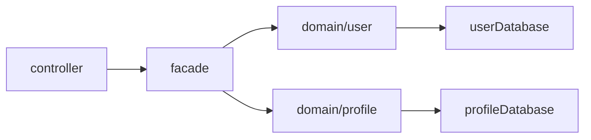

# woohakdong-server

## Commit Rule
| 구분 | 규칙 |
|------|------|
| Name | • `태그: 커밋 제목`의 규칙으로 작성 • 작은 단위로 커밋을 작성하는 것을 기본으로 함 |
| Tag type | • `Init` : 프로젝트 생성 • `Feat` : 새로운 기능 추가 • `Chore` : 사소한 코드 수정 • `Fix` : 에러 및 버그 수정 • `Docs` : 문서 수정 • `Design` : 디자인 관련 코드 추가 및 수정 • `Refactor` : 코드 리팩토링 • `CI/CD` : 배포 관련 설정 추가 및 수정 |

## Project Architecture
본 프로젝트는 Layered Architecture를 기반으로 설계되었으며, 다음과 같은 계층 구조와 역할을 가집니다:

| 계층         | 설명                                                                                            |
|------------|-----------------------------------------------------------------------------------------------|
| controller | 외부 요청을 수신하는 API 엔드포인트 계층입니다. 클라이언트로부터 들어온 요청을 검증한 후, 내부 로직 실행을 위해 facade 계층을 호출합니다.           |
| facade     | 복잡한 도메인 로직 호출을 조율하고, controller와 domain 사이의 흐름을 정리합니다. 여러 도메인 객체나 서비스를 조합하여 기능 단위의 처리를 담당합니다. |
| domain     | 핵심 비즈니스 로직이 위치한 계층으로, 데이터베이스 접근 역시 이 계층에서 직접 수행합니다. 엔티티, 레포지토리, 도메인 서비스 등이 포함됩니다.             |
| framework  | Spring Security, 인증 필터, 예외 처리 등 외부 프레임워크 관련 설정이 포함된 계층입니다.                                    |
| utils      | 계층 간 재사용 가능한 공통 유틸리티 클래스들을 모아둔 계층입니다. 순수 Java 로직만을 포함하며 상태를 가지지 않습니다.                         |

### 🔗 계층 간 의존성 규칙
- controller는 facade에만 의존합니다. 
- facade는 domain에만 의존합니다. 
- domain 내부에는 다시 도메인 단위로 폴더가 존재하며, 아래의 규칙을 통해 특정 도메인의 데이터 변경 케이스를 제한합니다.
  - CREATE, UPDATE, DELETE : 해당 도메인에서만 가능
  - READ : 다른 도메인에서도 가능
- domain 내부의 폴더끼리의 의존 관계는 크게 제약하지 않습니다. ( 나중에 규모가 더 커지면, 분리할 예정 )
- 데이터베이스 접근은 반드시 domain 계층 내에서만 수행됩니다. 이를 통해 핵심 로직과 데이터 일관성을 domain 내부에서 통제할 수 있도록 설계하였습니다.